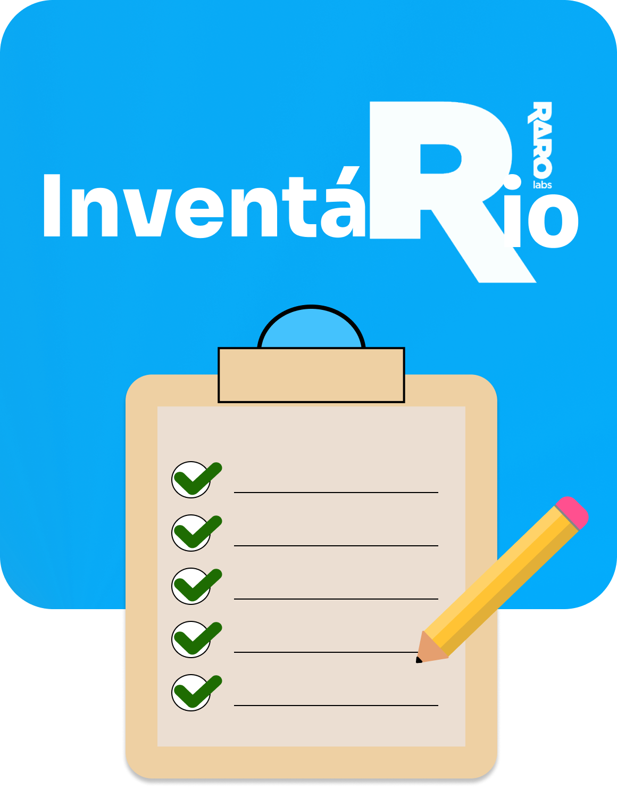

 
<h1 align='center'>Inventario-Raro </h1>
 

<h2 align="center"> Descrição </h2>

 

<h3 justify-content> Repositório criado para o projeto de conclusão da RaroAcademy, com o fim de implementar um sistema que faça o controle do inventário dos equipamentos eletrônicos da Raro Labs que são enviados aos colaboradores que entram na empresa. </h3>

 

<h2 align="center"> 
	Status do Projeto
</h2> 

 

<h3> Em andamento </h3>

 

<h2 align="center"> Composição da squad </h2>

 

<h3> O projeto é realizado pelo grupo 02 - `Undefined`, composto por Bernardo, Gabriel, Jackson e João Paulo.</h3>

